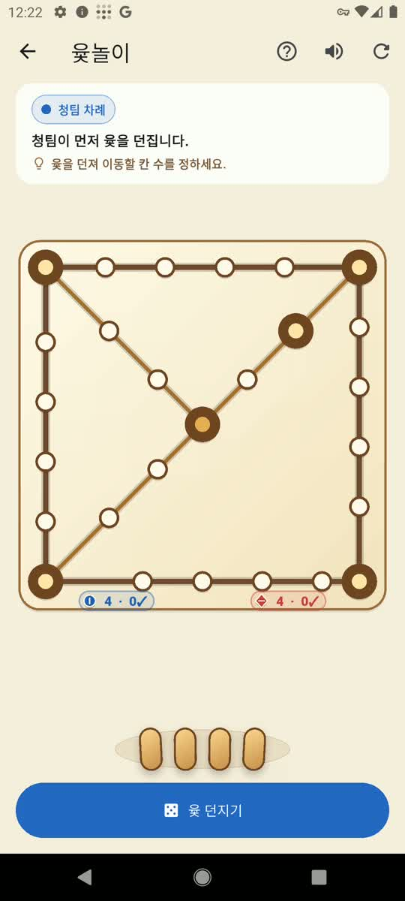

# Evidence and Demos

  <strong>English</strong> · <a href="evidence-and-demos.ko.md">한국어</a>

Palamedes is a research-alpha system. Its contracts and storage behavior are
heavily tested, while its claim to improve external decisions remains an active,
falsifiable product hypothesis.

## Evidence ledger

| Claim | Current evidence | Limit |
| --- | --- | --- |
| Revisionable plan-state kernel works | Revision, restore, fingerprint conflict, QA, and conformance tests | Does not prove better missions |
| Palamedes can reject weak reference treatment | The first cross-repository packet was blocked with explicit reasons | A successful rejection does not prove superior generation |
| Palamedes missions can beat a one-shot baseline in blinded review | `proof-002` won 8 of 9 model-review votes and all three case majorities | Reviewers were models, not independent human outcome evidence |
| Deeper cognition may improve reviewed mission quality | `proof-003` preserves blind comparisons and cost accounting | Generality and downstream effect remain unproven |
| Human-level creativity or startup success | Not established | No such claim is permitted |

## Cost and attribution

The first comparison used substantially more input tokens than its baseline.
Palamedes therefore reports token and call asymmetry and does not convert a
quality preference into cost-adjusted superiority. It also separates artifact
quality, implementation decisions, beneficiary outcomes, and owner labor.

## Live project demo

The Yut project demonstrates both capability and failure handling. Palamedes
generated and challenged product directions, but the implemented local game
diverged from the original online-multiplayer intent. The case is retained as
evidence of a boundary failure rather than rewritten as success.

[Watch the gameplay demo](../assets/demo/yut-gameplay-demo.mp4).

## Vision evidence

Vision Genesis and Vision Scout use hidden-reference cases to test whether a
model can originate a useful founder prompt before seeing a human proposal.
Trials isolate memory and separate detailed-vision review from origination
review. Machine passes can open human review; they cannot authorize delivery or
establish human-level creativity.

See [the live Vision Genesis record](vision-genesis-live-001.md) and the
benchmark commands in [cognition workflows](cognition-workflows.md).

## Reproduction paths

- [Proof program](../experiments/PROOF.md)
- [Proof portfolio](../experiments/proof-portfolio.json)
- [Cost portfolio](../experiments/proof-cost-portfolio.json)
- [First cross-repository preregistration](../experiments/case-001-insight-rag/preregistration.md)
- [Cycle 401](implementation/empirical-cycles/cycle-401.md)
- [Inquiry history](inquiry/2026-07-25-origin-and-evolution.md)

## Reading claims safely

Every result should be read as `claim -> evidence -> limitation -> next
discriminating observation`. Generated confidence, debate, retrieval, and
novelty scores are not independent evidence merely because they are recorded.
